# Configure-Windows-Group-Policy

## What is Group Policy?

Group Policy is a Windows Server feature that allows administrators to set rules and manage settings for users and computers in a network.

👉 With Group Policy, an admin can:

Block or allow access to Control Panel

Enforce password policies (length, complexity, expiry)

Restrict or allow software installations

Set desktop wallpaper or system configurations for all users

In this project, I configured Group Policy in Windows Server to manage user restrictions. First, I created two users and applied a domain-level policy to block the Control Panel. Then, I created an Organizational Unit (Demo OU) and moved one user into it. Finally, I linked the Group Policy to the OU, ensuring the restriction was applied only to that specific user. This project demonstrates practical skills in Active Directory management, Group Policy configuration, and policy scoping.

# Steps

1. First, I created two users in Active Directory to demonstrate this project.

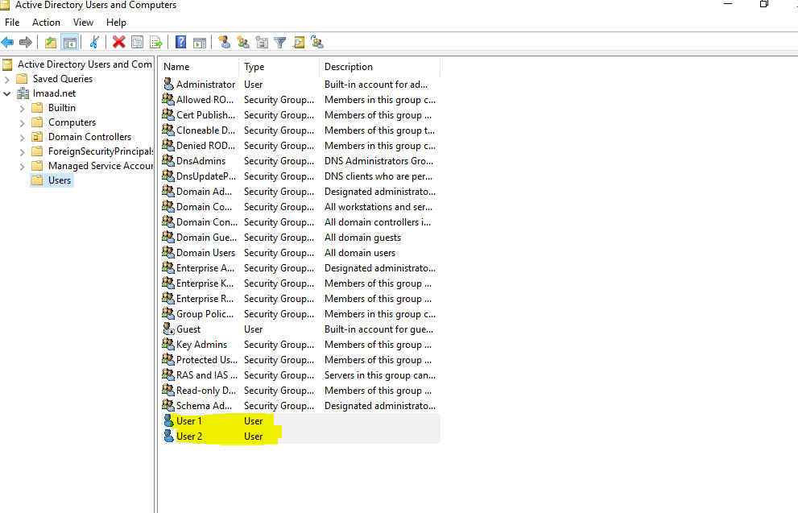

2. Next, I created an Organizational Unit, where I would later add a user and link the Group Policy.

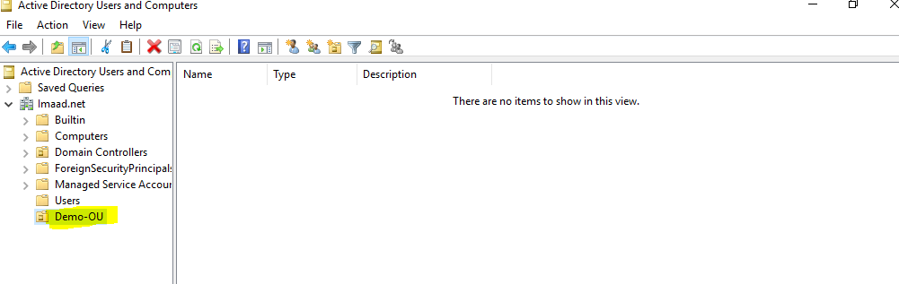

3. Now, I opened Group Policy Management to create a new Group Policy.

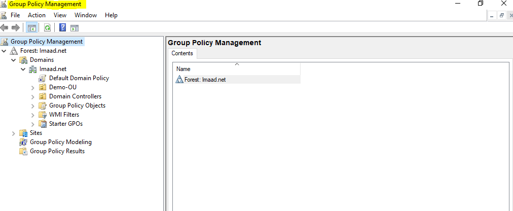

4. Next, I right-clicked on the domain and created a new Group Policy, assigning it a name.

   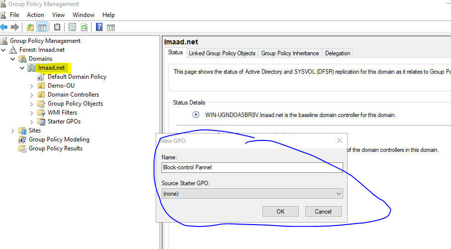

5. The newly created policy is now visible with its assigned name.

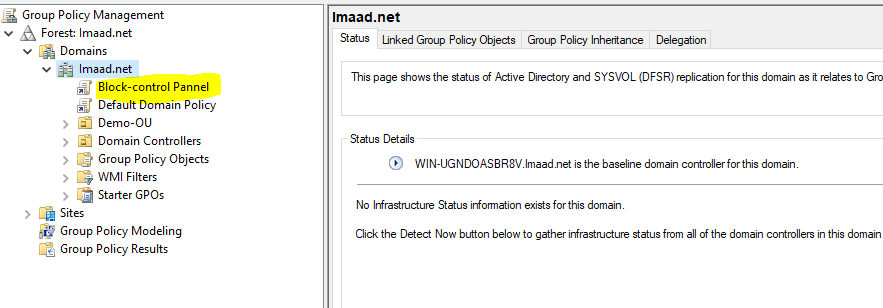

6. Now, right-click on the Group Policy that you created.

   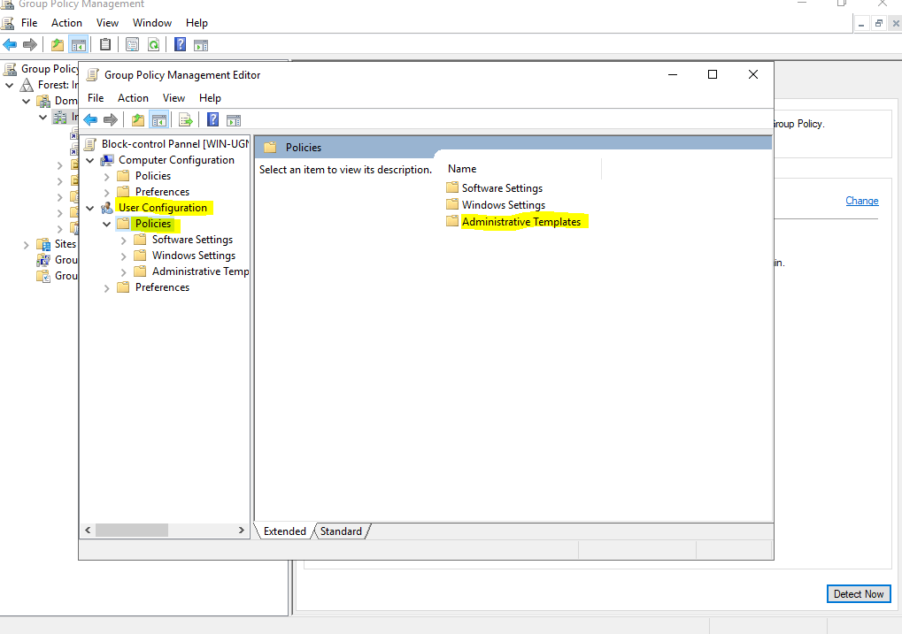

7. Next, go to Administrative Templates and select Control Panel, as I will be blocking the Control Panel in this project.

   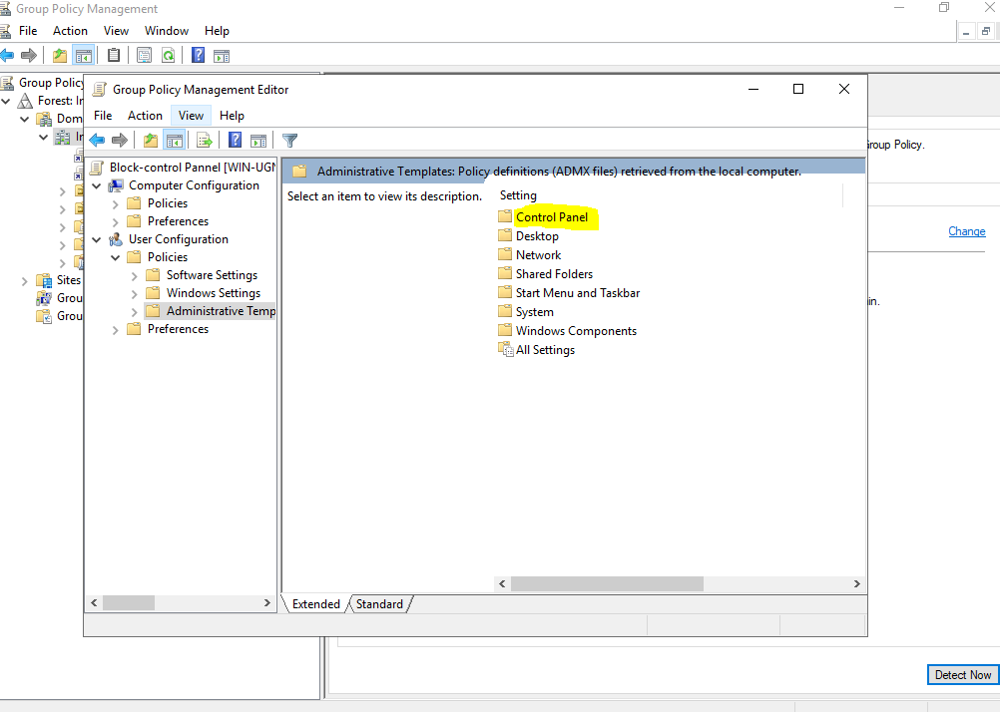

8. In the Control Panel settings, click on Prohibit access to Control Panel and PC settings

   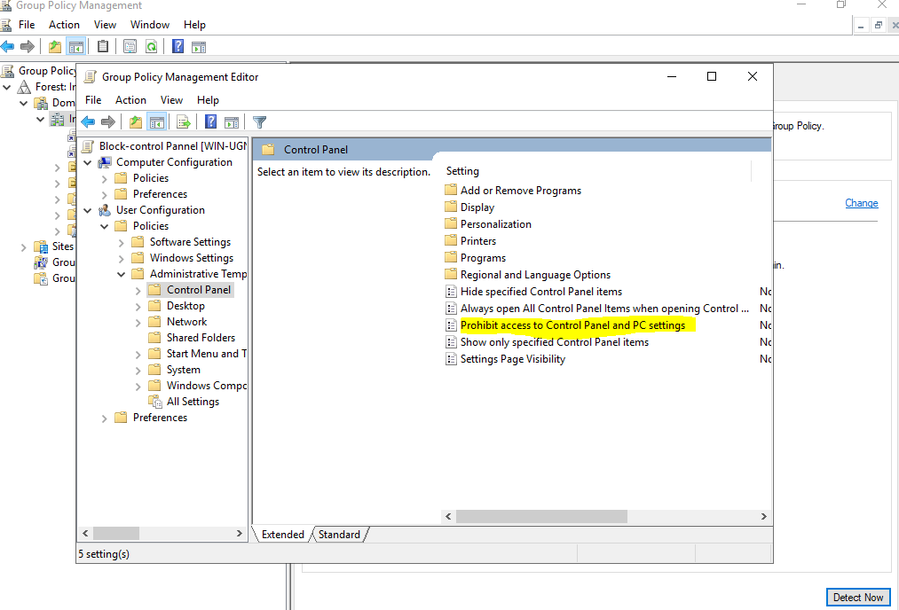

9. Now, enable the setting, click Apply, and then OK. Your policy is now configured.

    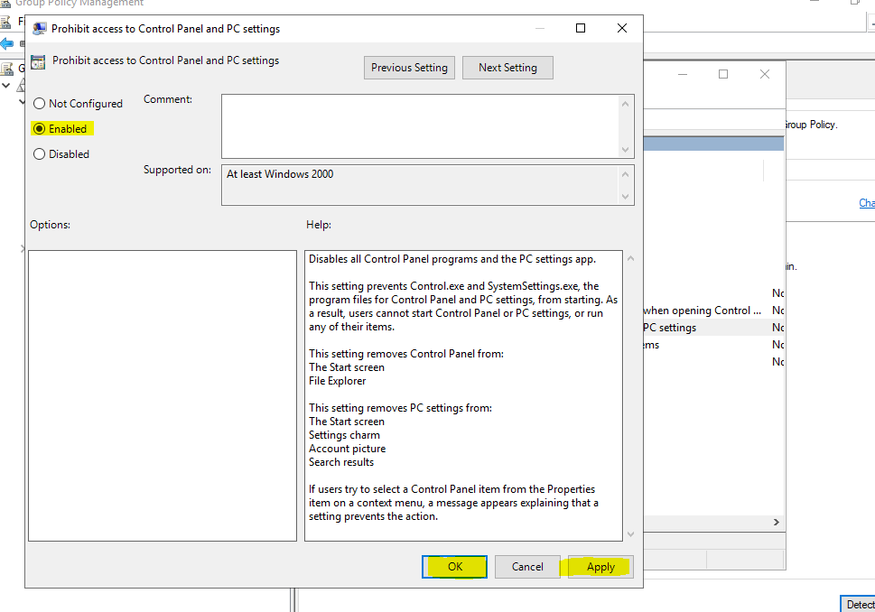

10. Now, update the policy by running the gpupdate command.

    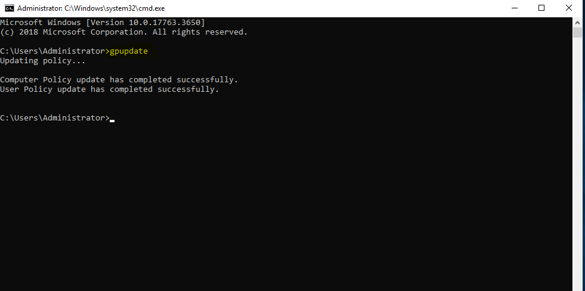

11. Now, when you try to open the Control Panel, it will be restricted because the policy is applied at the domain level. Next, we will apply it only to specific users.Here’s how we will do it

    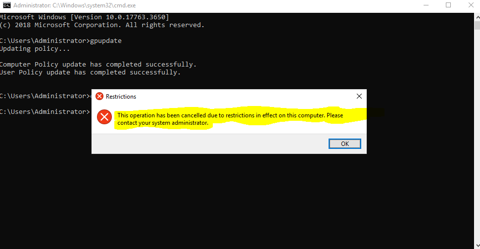

12. Now, move the user into the Organizational Unit that we created in the beginning.

    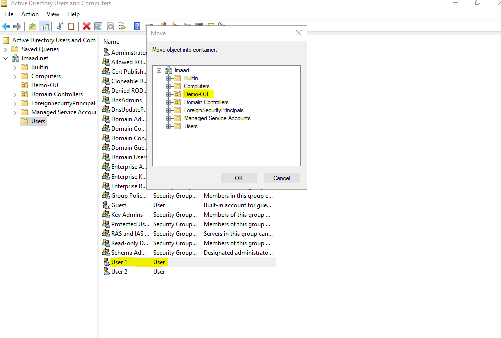

13. In the Group Policy section, link the Group Policy to the Organizational Unit and remove the domain-level policy.

    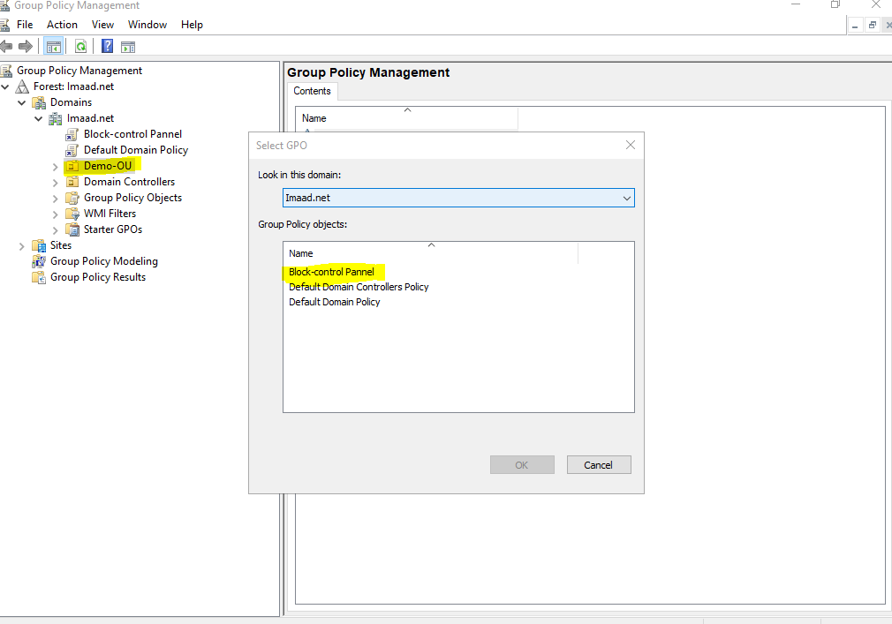

14. You can now see that the policy is linked with the Organizational Unit.

    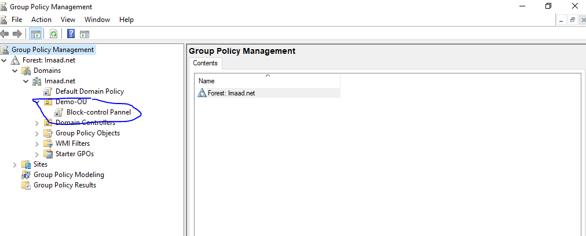

15. Now, when you try to open the Control Panel, it will open normally. However, the user added to the Organizational Unit will be restricted from accessing the Control Panel.

    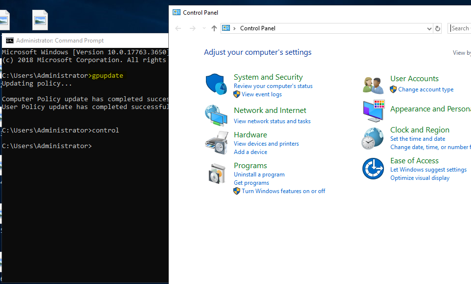
